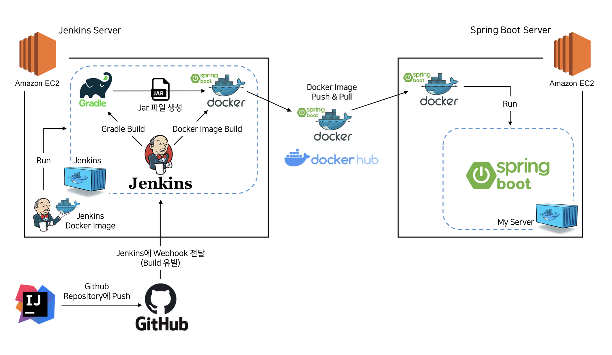

#  🌐 [coquality](https://www.co-quality.online/)

    

> 좋은 글을 보고 쓰고!
---
 

# 1. ❓ 서비스 소개
* 코퀄리티는 고퀄리티의 글을 보고 쓸 수 있는 블로깅 서비스입니다.

---
 

# 2. :two_men_holding_hands: 멤버 소개
| **🙋 [이제준](https://github.com/LeeJejune)** | **🙋 [지우영](https://github.com/ffalswo2)**   
|:---------------------:|:---------------------:|
|  |  

---
 

# 3. :computer: 핵심 기능
* 읽을 수 있는 글을 제공합니다.
    * 제목, 이미지, 글 내용, 태그, 글에 달린 박수(좋아요) 수, 댓글 수가 있습니다.
* 글을 저장할 수 있습니다.
    * 글을 저장할 때 저장했던 이유를 기술할 수 있습니다.
* 글을 쓸 수 있습니다.
    * 원하는 카테고리에 글을 작성할 수 있습니다.
* 마음에 드는 작가를 팔로우할 수 있습니다.

---
 

# 4. :video_game: 기술 스택
* Spring Boot
* Spring Data JPA
* Docker
* MySQL
* Jenkins
* AWS EC2
* AWS S3
* Route 53

---
 

# 5. 🔧 아키텍처

---
 

# 6. :department_store: 배포 파이프라인

---
 

# 7. :open_file_folder: 업데이트 내역
* 0.0.1
    * 개발 환경 구축
    * 글, 유저 도메인 구현
    * 글 CRUD 구현
* 0.0.2
    * API 문서 (Swagger)
    * oauth(kakao 적용) 로그인, 회원가입 추가
    * 유저 정보 수정하기 구현
* 0.0.3
    * 댓글 도메인 구현 및 CRUD 추가
    * 팔로우 도메인 구현 및 CRUD 추가
    * 박수 치기 기능 구현
    * 북마크 도메인 구현 및 저장 이유를 쓰는 기능 추가
    * 글의 하위 도메인 테그 구현
    * 마이페이지 기능 구현
* 0.0.4
    * 박수 치기 기능 수정
    * 내가 저장한글 기능 수정
